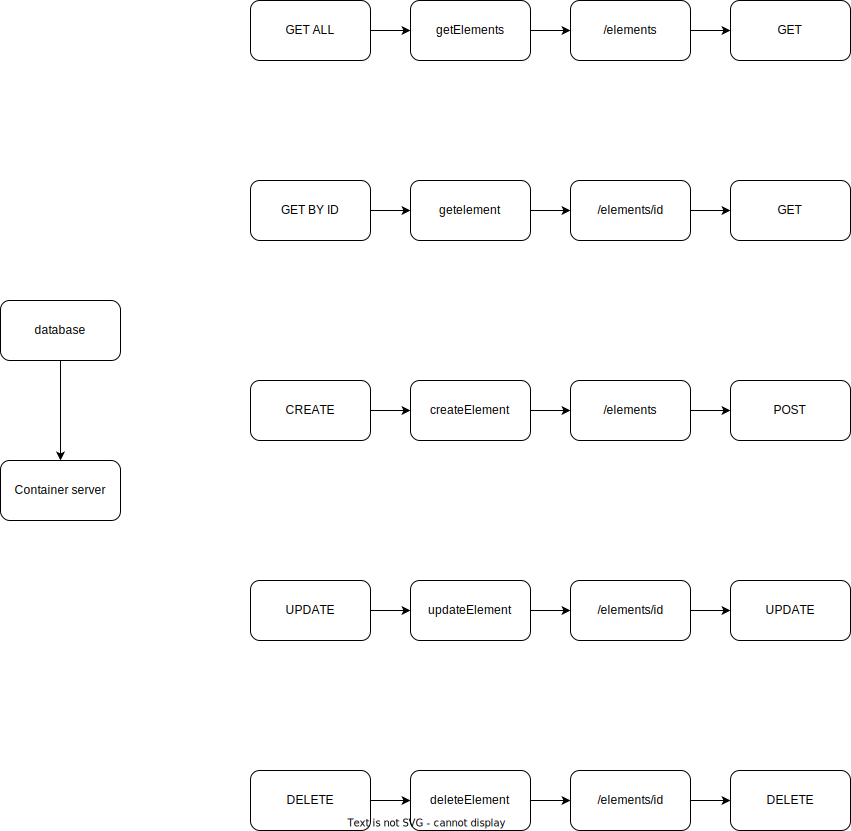

# ms-mvc microservice application.

a rework of the MVC architecture, this is my attempt to finish this course to better my understanding of microservices.


### ToDo: 
- add POST function to create an element
- add UPDATE function to update an element
- add DELETE function to delete an element
- add in database functionality to this app, currently it uses a variable to pull information from
- write a dockerfile to handle building the container images for this app
- add in k8s files to handle deployments
- write more tests
- add further logging capabilities to this app, we should be logging to stdout, so a logger like vector or logstash can pickup this info and store it.

This application differs from the one here:
https://github.com/federicoleon/golang-microservices/tree/master/mvc

as it uses a different data type and structs to describe elements in the periodic table.


_**With thanks to @FedericoLeon**_
https://github.com/federicoleon

for providing the course on udemy that inspired me to rework this application.


A few examples of requests that are sent to the application using curl, or you can use Postman to do these queries too.

- Starting the apiserver using `go run main.go`

```bash
# starting the application
 go run main.go
 
[GIN-debug] [WARNING] Creating an Engine instance with the Logger and Recovery middleware already attached.

[GIN-debug] [WARNING] Running in "debug" mode. Switch to "release" mode in production.
 - using env:   export GIN_MODE=release
 - using code:  gin.SetMode(gin.ReleaseMode)

[GIN-debug] GET    /elements/:element_id     --> github.com/GaryLouisStewart/ms-mvc/controllers.GetElement (3 handlers)
[GIN-debug] [WARNING] You trusted all proxies, this is NOT safe. We recommend you to set a value.
Please check https://pkg.go.dev/github.com/gin-gonic/gin#readme-don-t-trust-all-proxies for details.
[GIN-debug] Listening and serving HTTP on :8080
```

- Querying an element that doesn't exist within the db `curl <myendpoint>:<port>/<path>/<id>`
```bash
# running a curl request against the api with the wrong element id
 
curl localhost:8080/elements/111
   
{"message":"element 111 does not exist","status":404,"code":"not_found"}
```

- Querying a record that exists in the database this app uses, `curl <myendpoint>:<port>/<path>/<id>`
```bash
# running a curl request against the api to get an element that exists

curl localhost:8080/elements/1
  
{"id":1,"name":"Hydrogen","atomic_mass":1.00784,"melting_point":-259.2,"boiling_point":-252.9,"discovery_date":1766}
```

- Changing the output format of the api using `curl <myendpoint>:<port>/<path>/<id> -H "Accept:application/xml"
```bash
# running a curl request to get xml format back from the api instead of json

curl localhost:8080/elements/1 -H "Accept:application/xml"
   
<Element><Id>1</Id><Name>Hydrogen</Name><AtomicMass>1.00784</AtomicMass><MeltingPoint>-259.2</MeltingPoint><BoilingPoint>-252.9</BoilingPoint><DiscoveryDate>1766</DiscoveryDate></Element>
```

- Debugging using `curl <myendpoint>:<port>/<path>/<id> -v`
```bash
# debugging requests to the api using curl
curl localhost:8080/elements/1 -v
                            
*   Trying 127.0.0.1:8080...
* Connected to localhost (127.0.0.1) port 8080 (#0)
> GET /elements/1 HTTP/1.1
> Host: localhost:8080
> User-Agent: curl/7.79.1
> Accept: */*
> 
* Mark bundle as not supporting multiuse
< HTTP/1.1 200 OK
< Content-Type: application/json; charset=utf-8
< Date: Sun, 18 Sep 2022 13:18:07 GMT
< Content-Length: 116
< 
* Connection #0 to host localhost left intact
{"id":1,"name":"Hydrogen","atomic_mass":1.00784,"melting_point":-259.2,"boiling_point":-252.9,"discovery_date":1766}
```


Finally, a diagram of the intended setup of this application.

